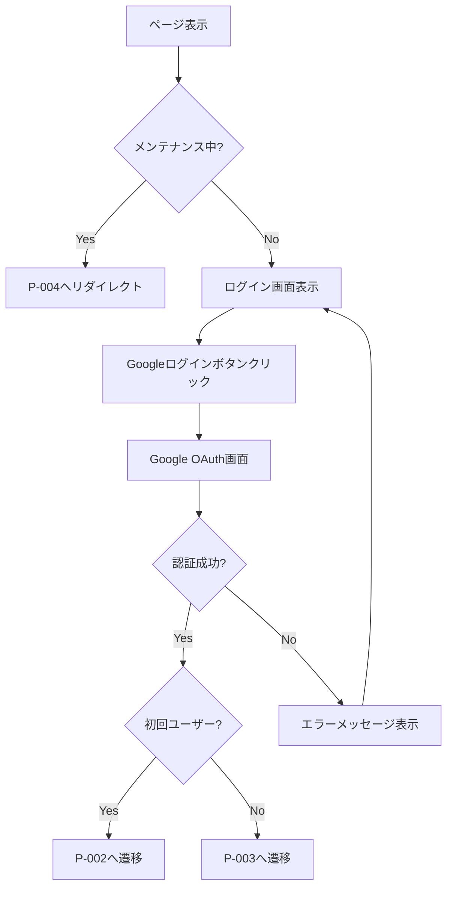
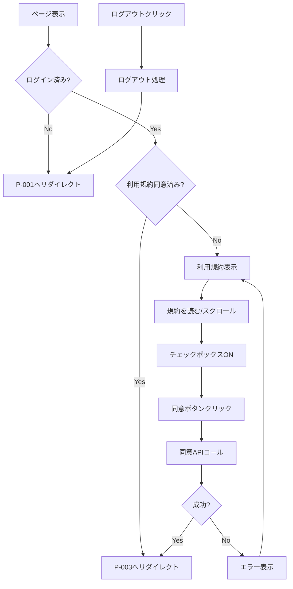
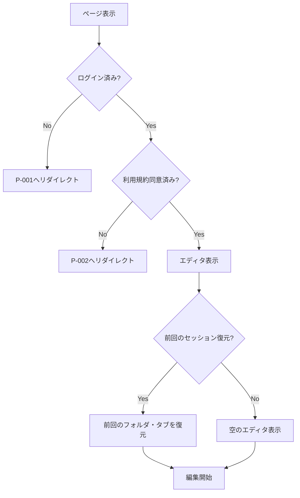
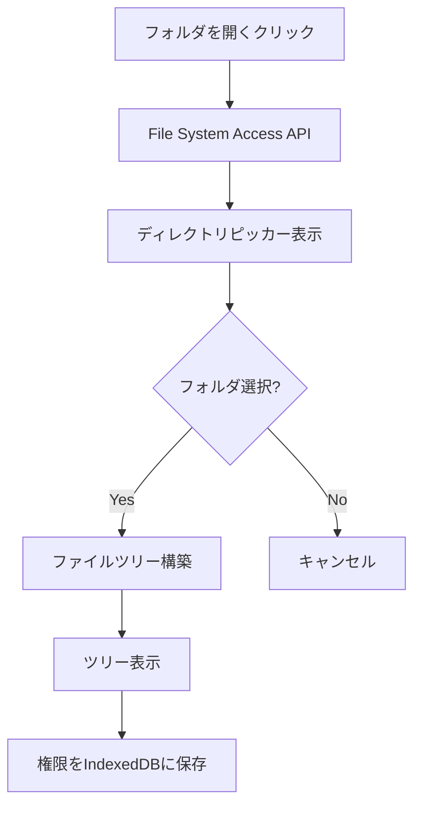
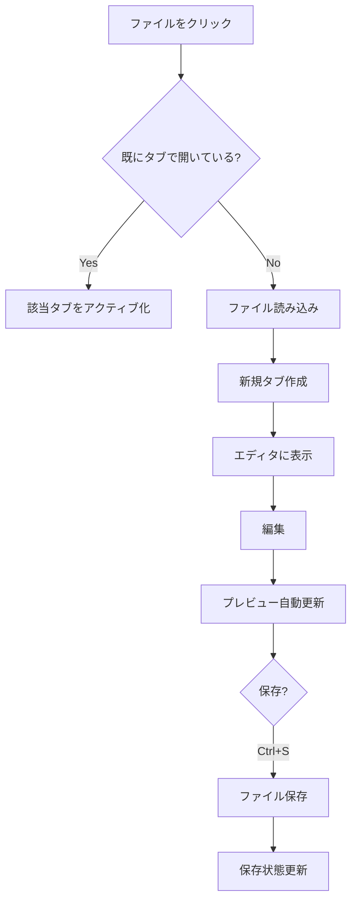
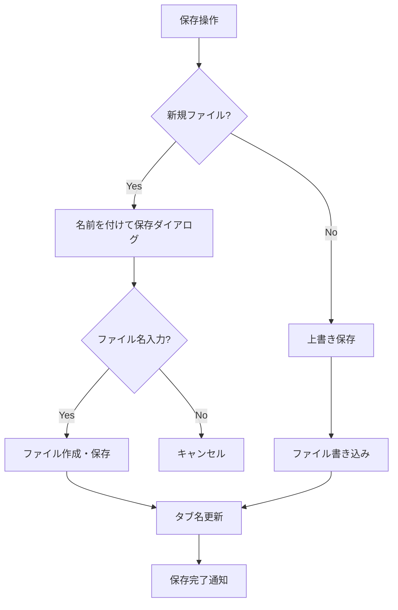
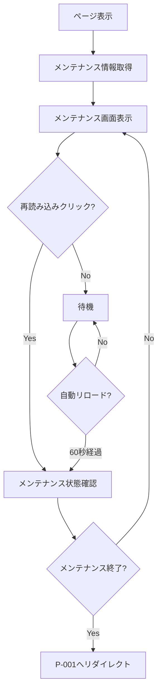
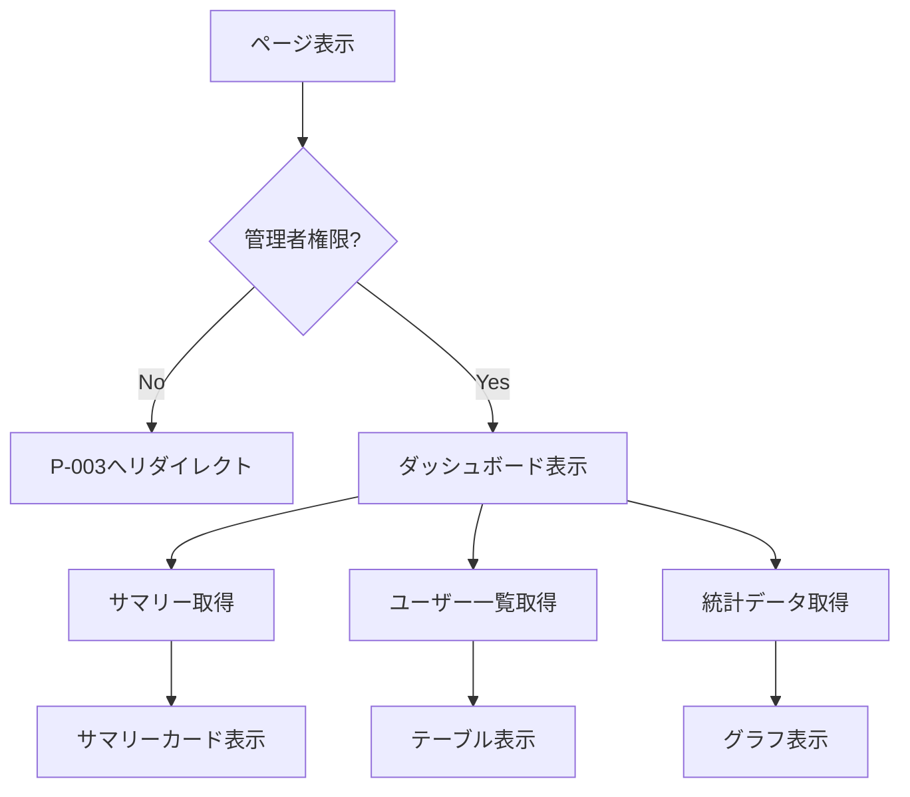
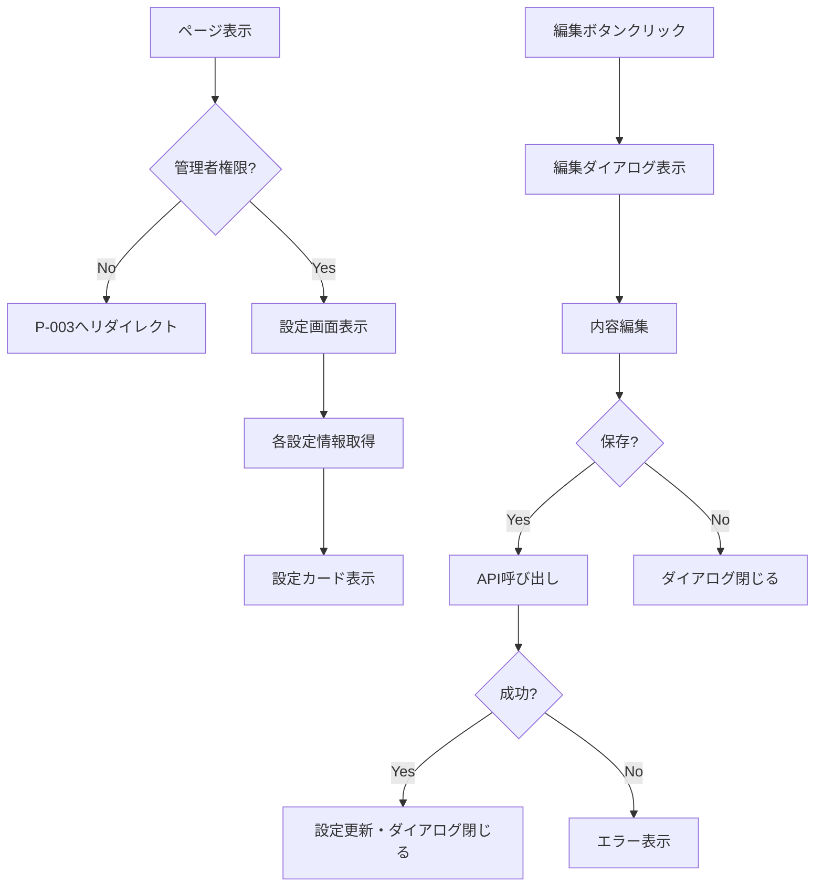

# マークダウンエディタ ページ詳細設計書

> **バージョン**: 3.0
> **作成日**: 2026-01-26
> **最終更新**: 2026-02-03
> **ステータス**: 確定

---

## 目次

1. [P-001: ログイン](#p-001-ログイン)
2. [P-002: 利用規約同意](#p-002-利用規約同意)
3. [P-003: エディタ](#p-003-エディタ)
4. [P-004: メンテナンス中](#p-004-メンテナンス中)
5. [A-001: 管理：利用状況](#a-001-管理利用状況)
6. [A-002: 管理：システム設定](#a-002-管理システム設定)

---

## P-001: ログイン

### 基本情報

| 項目 | 内容 |
|------|------|
| ページID | P-001 |
| ページ名 | ログイン |
| パス | `/login` |
| 対象ユーザー | 未ログインユーザー |
| 認証 | 不要 |

### 1. 画面構成

```
┌─────────────────────────────────────────────────────────────┐
│                      ヘッダー（ロゴ）                        │
├─────────────────────────────────────────────────────────────┤
│                                                             │
│                                                             │
│              ┌───────────────────────────┐                  │
│              │                           │                  │
│              │    Visual Studio風         │                  │
│              │    マークダウンエディタ     │                  │
│              │                           │                  │
│              │   [G] Googleでログイン     │                  │
│              │                           │                  │
│              │   対応ブラウザ案内文        │                  │
│              │   (Chrome/Edge推奨)        │                  │
│              │                           │                  │
│              └───────────────────────────┘                  │
│                                                             │
│                                                             │
├─────────────────────────────────────────────────────────────┤
│                      フッター                               │
└─────────────────────────────────────────────────────────────┘
```

#### レイアウト構成

| エリア | 説明 | 高さ |
|--------|------|------|
| ヘッダー | アプリロゴのみ | 64px |
| メインコンテンツ | ログインカード（中央配置） | calc(100vh - 128px) |
| フッター | コピーライト | 64px |

### 2. UI要素

#### ヘッダー

| 要素 | 種類 | 仕様 |
|------|------|------|
| ロゴ | 画像/テキスト | アプリ名「VS Markdown Editor」 |

#### ログインカード

| 要素ID | 要素 | 種類 | 仕様 |
|--------|------|------|------|
| login-title | タイトル | Typography | 「Visual Studio風マークダウンエディタ」 |
| login-subtitle | サブタイトル | Typography | 「ブラウザで動作する高機能エディタ」 |
| login-google-btn | Googleログインボタン | Button | Googleアイコン付き、プライマリカラー |
| login-browser-notice | ブラウザ案内 | Alert | 管理者が設定した案内文を表示 |

#### フッター

| 要素 | 種類 | 仕様 |
|------|------|------|
| コピーライト | Typography | 「© 2026 Visual Studio Markdown Editor」 |

### 3. 操作フロー



#### ユーザーアクション一覧

| No | アクション | トリガー | 処理 | 遷移先 |
|----|-----------|----------|------|--------|
| 1 | Googleログイン | ボタンクリック | Google OAuth認証 | P-002/P-003 |

### 4. 状態管理（Zustand）

#### 使用ストア: `authStore`

```typescript
interface AuthState {
  // 状態
  isLoading: boolean;           // ログイン処理中フラグ
  error: string | null;         // エラーメッセージ
  browserNotice: string;        // ブラウザ案内文（API取得）

  // アクション
  loginWithGoogle: () => Promise<void>;
  clearError: () => void;
}
```

### 5. API呼び出し

#### 初期表示時

| API | メソッド | パス | 説明 |
|-----|----------|------|------|
| メンテナンス状態取得 | GET | `/api/system/maintenance` | メンテナンス中かチェック |
| ブラウザ案内取得 | GET | `/api/system/browser-notice` | 表示する案内文取得 |

#### ログイン時

| API | メソッド | パス | 説明 |
|-----|----------|------|------|
| Google認証 | POST | `/api/auth/google` | Google IDトークン送信 |
| ユーザー情報取得 | GET | `/api/users/me` | ログインユーザー情報取得 |

#### レスポンス例

```typescript
// POST /api/auth/google
interface LoginResponse {
  accessToken: string;
  user: {
    id: string;
    email: string;
    name: string;
    isAdmin: boolean;
    hasAgreedTerms: boolean;  // 利用規約同意済みか
    createdAt: string;
  };
}
```

### 6. コンポーネント構成

```
LoginPage/
├── index.tsx              # ページコンポーネント
├── LoginCard.tsx          # ログインカード
├── GoogleLoginButton.tsx  # Googleログインボタン
└── BrowserNotice.tsx      # ブラウザ案内表示
```

### 7. セキュリティ改善（2026-02-03）

#### 実装済み改善
- ✅ **デモアカウント情報削除**: ログイン画面から「デモ用管理者アカウント admin@example.com」の表示を削除
  - 理由: セキュリティリスク軽減、本番環境における見た目改善
  - 実装: LoginPage から固定テキストを削除

---

## P-002: 利用規約同意

### 基本情報

| 項目 | 内容 |
|------|------|
| ページID | P-002 |
| ページ名 | 利用規約同意 |
| パス | `/terms` |
| 対象ユーザー | 初回ログインユーザー |
| 認証 | 必要（未同意状態） |

### 1. 画面構成

```
┌─────────────────────────────────────────────────────────────┐
│  ロゴ                                        [ログアウト]   │
├─────────────────────────────────────────────────────────────┤
│                                                             │
│              ┌───────────────────────────┐                  │
│              │     サービス利用規約        │                  │
│              ├───────────────────────────┤                  │
│              │                           │                  │
│              │  利用規約本文               │                  │
│              │  （スクロール可能）          │                  │
│              │                           │                  │
│              │  ...                      │                  │
│              │                           │                  │
│              ├───────────────────────────┤                  │
│              │  [×] 利用規約に同意する     │                  │
│              │                           │                  │
│              │  [同意してサービスを開始]    │                  │
│              └───────────────────────────┘                  │
│                                                             │
├─────────────────────────────────────────────────────────────┤
│                      フッター                               │
└─────────────────────────────────────────────────────────────┘
```

#### レイアウト構成

| エリア | 説明 | 高さ |
|--------|------|------|
| ヘッダー | ロゴ + ログアウトボタン | 64px |
| メインコンテンツ | 利用規約カード（中央配置） | calc(100vh - 128px) |
| フッター | コピーライト | 64px |

### 2. UI要素

#### ヘッダー

| 要素ID | 要素 | 種類 | 仕様 |
|--------|------|------|------|
| header-logo | ロゴ | 画像/Typography | アプリロゴ |
| header-logout | ログアウトボタン | Button | アウトライン、右寄せ |

#### 利用規約カード

| 要素ID | 要素 | 種類 | 仕様 |
|--------|------|------|------|
| terms-title | タイトル | Typography | 「サービス利用規約」h4 |
| terms-content | 利用規約本文 | Box | スクロール可能、max-height: 400px |
| terms-checkbox | 同意チェックボックス | Checkbox | 「利用規約に同意する」 |
| terms-submit | 同意ボタン | Button | 「同意してサービスを開始」disabled制御 |

### 3. 操作フロー



#### ユーザーアクション一覧

| No | アクション | トリガー | 処理 | 遷移先 |
|----|-----------|----------|------|--------|
| 1 | 利用規約スクロール | スクロール | 内容確認 | - |
| 2 | 同意チェック | チェックボックス | 同意ボタン有効化 | - |
| 3 | 同意する | ボタンクリック | 同意API呼び出し | P-003 |
| 4 | ログアウト | ボタンクリック | セッション破棄 | P-001 |

### 4. 状態管理（Zustand）

#### 使用ストア: `termsStore`

```typescript
interface TermsState {
  // 状態
  termsContent: string;         // 利用規約本文
  isAgreed: boolean;            // チェックボックス状態
  isLoading: boolean;           // 読み込み中
  isSubmitting: boolean;        // 送信中
  error: string | null;         // エラーメッセージ

  // アクション
  fetchTerms: () => Promise<void>;
  setAgreed: (agreed: boolean) => void;
  submitAgreement: () => Promise<void>;
}
```

### 5. API呼び出し

#### 初期表示時

| API | メソッド | パス | 説明 |
|-----|----------|------|------|
| 利用規約取得 | GET | `/api/system/terms` | 利用規約本文取得 |

#### 同意時

| API | メソッド | パス | 説明 |
|-----|----------|------|------|
| 利用規約同意 | POST | `/api/users/agree-terms` | 同意日時を記録 |

#### レスポンス例

```typescript
// GET /api/system/terms
interface TermsResponse {
  content: string;      // Markdown形式の利用規約
  version: string;      // バージョン（例: "1.0"）
  updatedAt: string;    // 更新日時
}

// POST /api/users/agree-terms
interface AgreeTermsRequest {
  version: string;  // 同意した規約バージョン
}
```

### 6. コンポーネント構成

```
TermsPage/
├── index.tsx              # ページコンポーネント
├── TermsCard.tsx          # 利用規約カード
├── TermsContent.tsx       # 利用規約本文表示
└── AgreementCheckbox.tsx  # 同意チェックボックス
```

---

## P-003: エディタ

### 基本情報

| 項目 | 内容 |
|------|------|
| ページID | P-003 |
| ページ名 | エディタ |
| パス | `/editor` |
| 対象ユーザー | ログイン済みユーザー（利用規約同意済み） |
| 認証 | 必要 |

### 1. 画面構成

```
┌─────────────────────────────────────────────────────────────────────────────┐
│ メニューバー                                                                 │
│ [ファイル▼] [編集▼] [表示▼] [ツール▼] [ヘルプ▼]              [User] [設定]  │
├────────────────┬────────────────────────────────────────────────────────────┤
│                │ タブバー                                                    │
│ サイドバー      │ [README.md ×] [index.ts ×] [+]                             │
│                ├────────────────────────────────────────────────────────────┤
│ ┌────────────┐ │                                                            │
│ │エクスプローラ│ │  ┌─────────────────────┬─────────────────────┐            │
│ ├────────────┤ │  │                     │                     │            │
│ │📁 Project   │ │  │     エディタ         │    プレビュー        │            │
│ │ ├─📁 docs   │ │  │     (Monaco)        │    (HTML)          │            │
│ │ │ └─📄 README│ │  │                     │                     │            │
│ │ ├─📁 src    │ │  │  # Title            │  <h1>Title</h1>     │            │
│ │ │ ├─📄 index│ │  │  ## Section         │  <h2>Section</h2>   │            │
│ │ │ └─📄 utils│ │  │  - item1            │  <ul>...</ul>       │            │
│ │ └─📄 package│ │  │  - item2            │                     │            │
│ ├────────────┤ │  │                     │                     │            │
│ │⭐お気に入り  │ │  │                     │                     │            │
│ ├────────────┤ │  │                     │                     │            │
│ │ ├─📄 memo.md│ │  │                     │                     │            │
│ │ └─📄 todo.md│ │  │                     │                     │            │
│ └────────────┘ │  └─────────────────────┴─────────────────────┘            │
│                │                                                            │
├────────────────┴────────────────────────────────────────────────────────────┤
│ ステータスバー                                               Ln 15, Col 23  │
│ UTF-8 | Markdown | 保存済み                                                 │
└─────────────────────────────────────────────────────────────────────────────┘
```

#### レイアウト構成

| エリア | 説明 | サイズ |
|--------|------|--------|
| メニューバー | ファイル操作、編集、表示切替 | height: 48px |
| サイドバー | ファイルツリー、お気に入り | width: 250px（リサイズ可） |
| タブバー | 開いているファイルのタブ | height: 36px |
| エディタ領域 | Monaco Editor | flex: 1（左側50%） |
| プレビュー領域 | HTMLプレビュー | flex: 1（右側50%） |
| ステータスバー | ファイル情報、カーソル位置 | height: 24px |

### 2. UI要素

#### 2.1 メニューバー

| 要素ID | 要素 | 種類 | 仕様 |
|--------|------|------|------|
| menu-file | ファイルメニュー | Menu | 新規、開く、保存、エクスポート等 |
| menu-edit | 編集メニュー | Menu | 元に戻す、やり直し、検索等 |
| menu-view | 表示メニュー | Menu | プレビュー、マインドマップ、分割表示 |
| menu-tools | ツールメニュー | Menu | 差分比較、Word変換 |
| menu-help | ヘルプメニュー | Menu | ショートカット、バージョン情報 |
| menu-user | ユーザーメニュー | IconButton + Menu | アカウント、ログアウト |
| menu-settings | 設定ボタン | IconButton | エディタ設定ダイアログ |

##### ファイルメニュー詳細

| メニュー項目 | ショートカット | 機能 |
|-------------|---------------|------|
| 新規ファイル | Ctrl+N | 新規マークダウンファイル作成 |
| フォルダを開く | Ctrl+K Ctrl+O | フォルダ選択ダイアログ |
| ファイルを開く | Ctrl+O | ファイル選択ダイアログ |
| 保存 | Ctrl+S | 上書き保存 |
| 名前を付けて保存 | Ctrl+Shift+S | 新規保存 |
| --- | --- | セパレーター |
| インポート | - | サブメニュー（Markdown, Text, Word） |
| エクスポート | - | サブメニュー（PDF, HTML, Word） |
| --- | --- | セパレーター |
| タブを閉じる | Ctrl+W | 現在のタブを閉じる |
| 全てのタブを閉じる | Ctrl+K W | 全タブを閉じる |

##### 表示メニュー詳細

| メニュー項目 | ショートカット | 機能 |
|-------------|---------------|------|
| プレビュー表示 | Ctrl+Shift+V | プレビューパネル表示/非表示 |
| マインドマップ | Ctrl+Shift+M | マインドマップビューに切替 |
| エディタのみ | - | エディタのみ表示 |
| プレビューのみ | - | プレビューのみ表示 |
| 左右分割 | - | エディタ+プレビュー横並び |
| 上下分割 | - | エディタ+プレビュー縦並び |
| --- | --- | セパレーター |
| サイドバー | Ctrl+B | サイドバー表示/非表示 |
| ステータスバー | - | ステータスバー表示/非表示 |

#### 2.2 サイドバー

##### エクスプローラー（ファイルツリー）

| 要素ID | 要素 | 種類 | 仕様 |
|--------|------|------|------|
| explorer-title | タイトル | Typography | 「エクスプローラー」 |
| explorer-folder-btn | フォルダ選択 | IconButton | フォルダアイコン |
| explorer-refresh-btn | 更新ボタン | IconButton | リフレッシュアイコン |
| explorer-tree | ファイルツリー | TreeView | 階層表示、アイコン付き |

##### ファイルツリーアイテム

| 要素 | 種類 | 仕様 |
|------|------|------|
| フォルダアイコン | Icon | 展開/折りたたみ対応 |
| ファイルアイコン | Icon | 拡張子別アイコン（.md, .txt等） |
| ファイル名 | Typography | クリックでファイルを開く |
| コンテキストメニュー | Menu | 右クリックで表示 |

##### ファイルツリーコンテキストメニュー

| メニュー項目 | 対象 | 機能 |
|-------------|------|------|
| 開く | ファイル | ファイルを開く |
| お気に入りに追加 | ファイル | お気に入り登録 |
| お気に入りから削除 | ファイル | お気に入り解除 |
| 新規ファイル | フォルダ | フォルダ内に新規ファイル作成 |
| 新規フォルダ | フォルダ | サブフォルダ作成 |
| 名前変更 | 両方 | 名前変更 |
| 削除 | 両方 | 削除確認後に削除 |
| パスをコピー | 両方 | フルパスをクリップボードにコピー |

##### お気に入り

| 要素ID | 要素 | 種類 | 仕様 |
|--------|------|------|------|
| favorites-title | タイトル | Typography | 「お気に入り」 |
| favorites-list | お気に入りリスト | List | 登録済みファイル一覧 |
| favorites-item | お気に入りアイテム | ListItem | ファイル名、アイコン、削除ボタン |

#### 2.3 タブバー

| 要素ID | 要素 | 種類 | 仕様 |
|--------|------|------|------|
| tab-bar | タブコンテナ | Box | 横スクロール可能 |
| tab-item | タブ | Tab | ファイル名、変更マーク、閉じるボタン |
| tab-add | 新規タブボタン | IconButton | + アイコン |

##### タブアイテム詳細

| 要素 | 説明 |
|------|------|
| ファイルアイコン | 拡張子別アイコン |
| ファイル名 | ファイル名（変更時は●マーク付き） |
| 閉じるボタン | × ボタン（ホバー時表示） |

##### タブコンテキストメニュー

| メニュー項目 | 機能 |
|-------------|------|
| 閉じる | このタブを閉じる |
| 他のタブを閉じる | 他の全タブを閉じる |
| 右のタブを閉じる | 右側の全タブを閉じる |
| 全てのタブを閉じる | 全タブを閉じる |
| パスをコピー | ファイルパスをコピー |

#### 2.4 エディタ領域

| 要素ID | 要素 | 種類 | 仕様 |
|--------|------|------|------|
| editor-monaco | Monaco Editor | Editor | マークダウン編集、シンタックスハイライト |
| editor-resizer | リサイザー | Divider | ドラッグでエディタ/プレビュー幅調整 |

##### Monaco Editor設定

| 設定項目 | デフォルト値 | 説明 |
|----------|-------------|------|
| language | markdown | 言語モード |
| theme | vs-dark / vs-light | テーマ（システム連動） |
| fontSize | 14 | フォントサイズ |
| wordWrap | on | 折り返し |
| minimap | { enabled: true } | ミニマップ表示 |
| lineNumbers | on | 行番号表示 |
| renderWhitespace | selection | 空白文字表示 |
| tabSize | 2 | タブサイズ |

#### 2.5 プレビュー領域

| 要素ID | 要素 | 種類 | 仕様 |
|--------|------|------|------|
| preview-container | プレビューコンテナ | Box | スクロール可能 |
| preview-content | プレビュー内容 | HTML | react-markdownでレンダリング |
| preview-toolbar | プレビューツールバー | Toolbar | 表示モード切替 |

##### プレビューツールバー

| 要素 | 機能 |
|------|------|
| プレビュー/マインドマップ切替 | ToggleButtonGroup |
| 同期スクロールON/OFF | Switch |
| 印刷プレビュー | Button |

#### 2.6 マインドマップ表示（プレビュー切替時）

| 要素ID | 要素 | 種類 | 仕様 |
|--------|------|------|------|
| mindmap-container | マインドマップコンテナ | Box | SVG表示領域 |
| mindmap-toolbar | ツールバー | Toolbar | 操作ボタン群 |
| mindmap-zoom-in | ズームイン | IconButton | + ボタン |
| mindmap-zoom-out | ズームアウト | IconButton | - ボタン |
| mindmap-reset | リセット | IconButton | フィット表示に戻す |
| mindmap-export | エクスポート | Button | SVG/PNGで保存 |

#### 2.7 差分比較モード

| 要素ID | 要素 | 種類 | 仕様 |
|--------|------|------|------|
| diff-container | 差分表示コンテナ | Box | 横並び2ペイン |
| diff-editor | Monaco Diff Editor | DiffEditor | 差分ハイライト表示 |
| diff-file-select-left | 左ファイル選択 | Select | 比較元ファイル |
| diff-file-select-right | 右ファイル選択 | Select | 比較先ファイル |
| diff-close | 差分モード終了 | Button | 通常モードに戻る |

#### 2.8 ステータスバー

| 要素ID | 要素 | 種類 | 仕様 |
|--------|------|------|------|
| status-encoding | エンコーディング | Typography | UTF-8 |
| status-language | 言語モード | Typography | Markdown |
| status-save | 保存状態 | Typography | 保存済み / 未保存 |
| status-position | カーソル位置 | Typography | Ln X, Col Y |
| status-selection | 選択文字数 | Typography | X文字選択中（選択時のみ） |

### 3. 操作フロー

#### 3.1 メインフロー



#### 3.2 フォルダ選択フロー



#### 3.3 ファイル編集フロー



#### 3.4 ファイル保存フロー



#### ユーザーアクション一覧

| No | アクション | トリガー | 処理 | 備考 |
|----|-----------|----------|------|------|
| 1 | フォルダを開く | メニュー/Ctrl+K Ctrl+O | フォルダ選択 | File System Access API |
| 2 | ファイルを開く | ツリークリック | タブ追加・表示 | - |
| 3 | タブ切替 | タブクリック | エディタ内容切替 | - |
| 4 | タブを閉じる | ×ボタン/Ctrl+W | タブ削除 | 未保存時は確認 |
| 5 | 編集 | キー入力 | エディタ更新 | - |
| 6 | 保存 | Ctrl+S | ファイル保存 | - |
| 7 | 名前を付けて保存 | Ctrl+Shift+S | 新規保存 | - |
| 8 | プレビュー切替 | Ctrl+Shift+V | 表示切替 | - |
| 9 | マインドマップ | Ctrl+Shift+M | マインドマップ表示 | - |
| 10 | 差分比較 | ツールメニュー | 差分エディタ表示 | - |
| 11 | お気に入り登録 | 右クリックメニュー | お気に入り追加 | - |
| 12 | エクスポート | ファイルメニュー | PDF/HTML/Word出力 | - |
| 13 | インポート | ファイルメニュー | ファイル取込 | Word変換含む |

### 4. 状態管理（Zustand）

#### 4.1 ファイルストア: `fileStore`

```typescript
interface FileNode {
  id: string;
  name: string;
  path: string;
  type: 'file' | 'folder';
  children?: FileNode[];
  handle?: FileSystemHandle;  // File System Access API
}

interface FileState {
  // 状態
  rootFolder: FileNode | null;       // ルートフォルダ
  rootHandle: FileSystemDirectoryHandle | null;  // フォルダハンドル
  expandedFolders: Set<string>;      // 展開中フォルダID
  isLoading: boolean;

  // アクション
  openFolder: () => Promise<void>;
  refreshFolder: () => Promise<void>;
  toggleFolder: (folderId: string) => void;
  createFile: (parentId: string, name: string) => Promise<void>;
  createFolder: (parentId: string, name: string) => Promise<void>;
  deleteNode: (nodeId: string) => Promise<void>;
  renameNode: (nodeId: string, newName: string) => Promise<void>;
}
```

#### 4.2 タブストア: `tabStore`

```typescript
interface Tab {
  id: string;
  fileId: string;
  fileName: string;
  filePath: string;
  content: string;
  originalContent: string;    // 保存時の内容（変更検知用）
  isDirty: boolean;           // 未保存変更あり
  handle?: FileSystemFileHandle;
}

interface TabState {
  // 状態
  tabs: Tab[];
  activeTabId: string | null;

  // アクション
  openTab: (file: FileNode) => Promise<void>;
  closeTab: (tabId: string) => Promise<boolean>;  // 未保存時false返却
  closeOtherTabs: (tabId: string) => Promise<void>;
  closeAllTabs: () => Promise<void>;
  setActiveTab: (tabId: string) => void;
  updateContent: (tabId: string, content: string) => void;
  saveTab: (tabId: string) => Promise<void>;
  saveTabAs: (tabId: string) => Promise<void>;
}
```

#### 4.3 エディタストア: `editorStore`

```typescript
interface EditorSettings {
  fontSize: number;
  theme: 'vs-dark' | 'vs-light' | 'auto';
  wordWrap: 'on' | 'off' | 'wordWrapColumn';
  minimap: boolean;
  lineNumbers: 'on' | 'off' | 'relative';
  tabSize: number;
}

interface EditorState {
  // 状態
  settings: EditorSettings;
  cursorPosition: { line: number; column: number };
  selection: { start: number; end: number } | null;

  // アクション
  updateSettings: (settings: Partial<EditorSettings>) => void;
  setCursorPosition: (line: number, column: number) => void;
  setSelection: (start: number, end: number) => void;
}
```

#### 4.4 プレビューストア: `previewStore`

```typescript
type ViewMode = 'preview' | 'mindmap';
type SplitMode = 'horizontal' | 'vertical' | 'editor-only' | 'preview-only';

interface PreviewState {
  // 状態
  viewMode: ViewMode;
  splitMode: SplitMode;
  splitRatio: number;           // 0-100（エディタの割合）
  syncScroll: boolean;          // 同期スクロールON/OFF

  // アクション
  setViewMode: (mode: ViewMode) => void;
  setSplitMode: (mode: SplitMode) => void;
  setSplitRatio: (ratio: number) => void;
  toggleSyncScroll: () => void;
}
```

#### 4.5 お気に入りストア: `favoriteStore`

```typescript
interface Favorite {
  id: string;
  filePath: string;
  fileName: string;
  addedAt: string;
}

interface FavoriteState {
  // 状態
  favorites: Favorite[];
  isLoading: boolean;

  // アクション
  fetchFavorites: () => Promise<void>;
  addFavorite: (filePath: string, fileName: string) => Promise<void>;
  removeFavorite: (id: string) => Promise<void>;
  checkFileExists: (id: string) => Promise<boolean>;
}
```

#### 4.6 UIストア: `uiStore`

```typescript
interface UIState {
  // 状態
  sidebarVisible: boolean;
  sidebarWidth: number;
  statusBarVisible: boolean;
  isDiffMode: boolean;
  diffFiles: { left: string; right: string } | null;

  // アクション
  toggleSidebar: () => void;
  setSidebarWidth: (width: number) => void;
  toggleStatusBar: () => void;
  enterDiffMode: (leftPath: string, rightPath: string) => void;
  exitDiffMode: () => void;
}
```

### 5. API呼び出し

#### 初期表示時

| API | メソッド | パス | 説明 |
|-----|----------|------|------|
| ユーザー情報取得 | GET | `/api/users/me` | ログイン状態確認 |
| お気に入り取得 | GET | `/api/favorites` | お気に入りファイル一覧 |
| 設定取得 | GET | `/api/users/settings` | エディタ設定 |

#### お気に入り操作

| API | メソッド | パス | 説明 |
|-----|----------|------|------|
| お気に入り追加 | POST | `/api/favorites` | お気に入り登録 |
| お気に入り削除 | DELETE | `/api/favorites/{id}` | お気に入り解除 |

#### 設定保存

| API | メソッド | パス | 説明 |
|-----|----------|------|------|
| 設定保存 | PUT | `/api/users/settings` | エディタ設定保存 |

#### エクスポート（バックエンド経由の場合）

| API | メソッド | パス | 説明 |
|-----|----------|------|------|
| Word出力 | POST | `/api/export/word` | マークダウン→Word変換 |

#### レスポンス例

```typescript
// GET /api/favorites
interface FavoritesResponse {
  favorites: Array<{
    id: string;
    filePath: string;
    fileName: string;
    addedAt: string;
  }>;
}

// GET /api/users/settings
interface UserSettingsResponse {
  editor: {
    fontSize: number;
    theme: string;
    wordWrap: string;
    minimap: boolean;
    lineNumbers: string;
    tabSize: number;
  };
  lastFolderPath?: string;    // 前回開いたフォルダ
  recentFiles?: string[];     // 最近開いたファイル
}
```

### 6. コンポーネント構成

```
EditorPage/
├── index.tsx                    # ページコンポーネント
├── Layout/
│   ├── EditorLayout.tsx         # 全体レイアウト
│   ├── MenuBar/
│   │   ├── MenuBar.tsx          # メニューバー
│   │   ├── FileMenu.tsx         # ファイルメニュー
│   │   ├── EditMenu.tsx         # 編集メニュー
│   │   ├── ViewMenu.tsx         # 表示メニュー
│   │   ├── ToolsMenu.tsx        # ツールメニュー
│   │   └── HelpMenu.tsx         # ヘルプメニュー
│   ├── Sidebar/
│   │   ├── Sidebar.tsx          # サイドバー
│   │   ├── Explorer.tsx         # エクスプローラー
│   │   ├── FileTree.tsx         # ファイルツリー
│   │   ├── FileTreeItem.tsx     # ツリーアイテム
│   │   ├── FileContextMenu.tsx  # コンテキストメニュー
│   │   └── Favorites.tsx        # お気に入り
│   ├── TabBar/
│   │   ├── TabBar.tsx           # タブバー
│   │   ├── Tab.tsx              # タブ
│   │   └── TabContextMenu.tsx   # タブコンテキストメニュー
│   └── StatusBar/
│       └── StatusBar.tsx        # ステータスバー
├── Editor/
│   ├── MonacoEditor.tsx         # Monacoエディタラッパー
│   ├── EditorPane.tsx           # エディタペイン
│   └── DiffEditor.tsx           # 差分エディタ
├── Preview/
│   ├── PreviewPane.tsx          # プレビューペイン
│   ├── MarkdownPreview.tsx      # マークダウンプレビュー
│   └── PreviewToolbar.tsx       # プレビューツールバー
├── Mindmap/
│   ├── MindmapPane.tsx          # マインドマップペイン
│   ├── MindmapView.tsx          # マインドマップ表示
│   └── MindmapToolbar.tsx       # マインドマップツールバー
├── Dialogs/
│   ├── SettingsDialog.tsx       # 設定ダイアログ
│   ├── ExportDialog.tsx         # エクスポートダイアログ
│   ├── ImportDialog.tsx         # インポートダイアログ
│   ├── SaveConfirmDialog.tsx    # 保存確認ダイアログ
│   └── DeleteConfirmDialog.tsx  # 削除確認ダイアログ
└── hooks/
    ├── useFileSystem.ts         # File System Access API
    ├── useKeyboardShortcuts.ts  # キーボードショートカット
    ├── useSyncScroll.ts         # 同期スクロール
    └── useAutoSave.ts           # 自動保存
```

### 7. キーボードショートカット一覧

| ショートカット | 機能 |
|---------------|------|
| Ctrl+N | 新規ファイル |
| Ctrl+O | ファイルを開く |
| Ctrl+K Ctrl+O | フォルダを開く |
| Ctrl+S | 保存 |
| Ctrl+Shift+S | 名前を付けて保存 |
| Ctrl+W | タブを閉じる |
| Ctrl+Tab | 次のタブへ |
| Ctrl+Shift+Tab | 前のタブへ |
| Ctrl+Z | 元に戻す |
| Ctrl+Y | やり直し |
| Ctrl+F | 検索 |
| Ctrl+H | 置換 |
| Ctrl+Shift+V | プレビュー切替 |
| Ctrl+Shift+M | マインドマップ切替 |
| Ctrl+B | サイドバー切替 |
| Ctrl+1〜9 | n番目のタブへ |
| F11 | フルスクリーン |

---

## P-003.1: メニューバー詳細仕様

### 目的
Visual Studio風の操作性を実現するため、メニューバーで一般的なファイル操作・編集機能を提供

### メニュー構成

**ファイル（F）メニュー**
| 項目 | ショートカット | 説明 |
|------|--------------|------|
| 新しいファイル | Alt+N | 新規ファイルを作成 |
| 新しいフォルダー | Alt+B | 新規フォルダーを作成（フォルダ選択時のみ） |
| ファイルを開く | Alt+O | ファイルを開く |
| フォルダーを開く | Alt+U | フォルダーを開く（File System Access API） |
| インポート | Alt+I | Word/テキストファイルをインポート |
| 保存 | Ctrl+S | 現在のファイルを保存 |
| 名前を付けて保存 | Alt+S | 新しい名前で保存 |
| すべて保存 | Ctrl+Alt+S | すべてのタブを保存 |
| エクスポート | - | PDF/HTML/Word形式でエクスポート（サブメニュー） |
| タブを閉じる | Alt+K | 現在のタブを閉じる |
| 全てのタブを閉じる | Alt+J | すべてのタブを閉じる |

**編集（E）メニュー**
| 項目 | ショートカット | 説明 |
|------|--------------|------|
| 元に戻す | Ctrl+Z | 最後の編集を取り消す |
| やり直し | Ctrl+Y | 取り消した編集をやり直す |
| 検索 | Ctrl+F | テキスト検索ダイアログを開く |
| 置換 | Ctrl+R | テキスト置換ダイアログを開く |
| 前のタブ | Alt+Z | 前のタブに切り替え |
| 次のタブ | Alt+X | 次のタブに切り替え |

**表示（V）メニュー**
| 項目 | ショートカット | 説明 |
|------|--------------|------|
| プレビュー | Alt+L | プレビューパネルの表示/非表示 |
| マインドマップ | Alt+M | マインドマップ表示の表示/非表示 |
| 分割エディタ | Alt+D | 分割エディタ表示の表示/非表示 |
| サイドバー | Alt+W | ファイルツリー（左パネル）の表示/非表示 |
| 差分比較 | Ctrl+Alt+C | 差分比較モードの開始/終了 |

**ツール（T）メニュー**
| 項目 | ショートカット | 説明 |
|------|--------------|------|
| 設定 | - | エディタ設定ダイアログを開く |

**ヘルプ（H）メニュー**
| 項目 | ショートカット | 説明 |
|------|--------------|------|
| キーボードショートカット | - | ショートカット一覧ダイアログを開く |
| ヘルプ | - | ヘルプページを開く |
| バージョン情報 | - | バージョン情報ダイアログを表示 |

### 実装上の注意点
- Alt キーでメニューアクセス時のニーモニック表示
- メニュー項目の有効/無効状態を適切に切り替え（例：フォルダ未選択時は新規フォルダー無効）
- ナビゲーションアイコン（◀ ▶）で前後のタブ切り替えを視覚的に表現

---

## P-003.2: 差分比較機能詳細仕様

### 目的
2つのファイルの内容を視覚的に比較し、変更点を明確に表示する

### 主要機能
- **Side-by-side表示**: 左側（original）と右側（modified）に並べて表示
- **差分ハイライト**: 削除行は赤色、追加行は緑色で強調
- **行番号表示**: 両側に行番号を表示して対比を容易に
- **グリフマージン**: 行番号左側に差分インジケーターを表示
- **独立した編集**: 左右両側のエディタで編集可能
- **リアルタイム更新**: 編集内容がタブに即座に反映

### 技術仕様（Monaco Diff Editor）
```typescript
// 主要設定
{
  renderSideBySide: true,          // 並べて表示
  renderIndicators: true,          // 差分インジケーター表示
  glyphMargin: true,               // グリフマージン有効化
  renderOverviewRuler: true,       // overview ruler表示
  overviewRulerLanes: 3,           // overview ruler の表示レーン数
  enableSplitViewResizing: true,   // リサイズ可能
  ignoreTrimWhitespace: false,     // 末尾空白も比較対象
  originalEditable: true,          // 左側エディタ編集可能
  readOnly: false,                 // 右側エディタ編集可能
}

// イベントハンドラー
- onOriginalChange: 左側（original）の編集内容を検出
- onModifiedChange: 右側（modified）の編集内容を検出
```

### ユーザー操作フロー
1. エディタページで「差分比較」メニューを選択
2. システムが差分比較モード開始
3. ユーザーがタブから左右のファイルを選択
4. Monaco Diff Editor が2つのファイルを並べて表示
5. 差分部分が色付き（赤=削除、緑=追加）で表示
6. ユーザーが左右どちらのエディタでも編集可能
7. Ctrl+S で編集内容を保存
8. 「通常モードに戻る」で比較終了

---

## P-003.3: 設定機能詳細仕様

### 目的
エディタの表示・動作設定をユーザーがカスタマイズする

### 設定項目
| 設定項目 | 説明 | デフォルト値 |
|---------|------|------------|
| フォントサイズ | エディタのフォントサイズ（10-20px） | 14px |
| 折り返し | 長い行の自動折り返し設定 | On |
| ミニマップ表示 | 右側ミニマップの表示/非表示 | Off |
| 行番号表示 | 左側行番号の表示/非表示 | On |

### 削除された設定
- **カラーテーマ選択**: VS Code標準のダークテーマ（vs-dark）で固定化
  - 理由: 単一テーマでの管理により、UIの複雑さ削減と安定性向上
  - テーマ自動検出: ブラウザのダークモード設定に基づいて自動適用

### セキュリティ改善（2026-02-03）

#### 実装済み改善
- ✅ **RegisterPage の自動入力防止**
  - メールアドレス: `autoComplete: 'off'`
  - パスワード: `autoComplete: 'new-password'`
  - パスワード（確認）: `autoComplete: 'new-password'`
  - フォーム: `autoComplete: "off"` を設定
  - useEffect でマウント時にフォーム値をリセット
  - 前回ログイン時の認証情報が表示されないように改善

#### UI/UX改善（2026-02-03）

- ✅ **HelpDialog の初期表示修正**
  - ダイアログを開く度に「概要」タブが表示されるように修正
  - useEffect で `open` プロップ変化を検出して `setTabValue(0)` を実行

- ✅ **VersionInfoDialog の初期表示修正**
  - ダイアログを開く度に「バージョン」タブが表示されるように修正
  - Dialog の `TransitionProps.onEntered` コールバックを使用
  - ダイアログが完全に開かれた時点でタブをリセット

- ✅ **バージョン情報ダイアログのデザイン統一**
  - ヘルプダイアログのデザインに統一
  - 背景色: #2D2D2D（ダークテーマ）
  - タイトル背景: #1E1E1E
  - テキスト色: #fff / #ccc（明るい色）
  - タブ: 非選択時 #888、選択時 #0078d4
  - ボタン: 「OK」→「閉じる」に変更
  - ボーダー: #3C3C3C で統一

#### 日本語用語の統一（2026-02-03）
- ✅ **フォルダー表記の統一**
  - Sidebar.tsx: 「フォルダが開かれていません」→「フォルダーが開かれていません」
  - EditorPage/index.tsx: 「フォルダが開かれていません」→「フォルダーが開かれていません」
  - エクスプローラー更新ボタンでのメッセージを統一

---

## P-004: メンテナンス中

### 基本情報

| 項目 | 内容 |
|------|------|
| ページID | P-004 |
| ページ名 | メンテナンス中 |
| パス | `/maintenance` |
| 対象ユーザー | 全ユーザー |
| 認証 | 不要 |

### 1. 画面構成

```
┌─────────────────────────────────────────────────────────────┐
│                      ヘッダー（ロゴ）                        │
├─────────────────────────────────────────────────────────────┤
│                                                             │
│                                                             │
│              ┌───────────────────────────┐                  │
│              │                           │                  │
│              │      🔧 メンテナンス中     │                  │
│              │                           │                  │
│              │  ただいまシステムメンテナンス │                  │
│              │  を実施中です。            │                  │
│              │                           │                  │
│              │  終了予定時刻:             │                  │
│              │  2026年1月26日 15:00      │                  │
│              │                           │                  │
│              │  ご不便をおかけして申し訳    │                  │
│              │  ございません。             │                  │
│              │                           │                  │
│              │        [再読み込み]        │                  │
│              │                           │                  │
│              └───────────────────────────┘                  │
│                                                             │
│                                                             │
├─────────────────────────────────────────────────────────────┤
│                      フッター                               │
└─────────────────────────────────────────────────────────────┘
```

#### レイアウト構成

| エリア | 説明 | 高さ |
|--------|------|------|
| ヘッダー | アプリロゴのみ | 64px |
| メインコンテンツ | メンテナンスカード（中央配置） | calc(100vh - 128px) |
| フッター | コピーライト | 64px |

### 2. UI要素

#### メンテナンスカード

| 要素ID | 要素 | 種類 | 仕様 |
|--------|------|------|------|
| maint-icon | アイコン | Icon | 🔧 ツールアイコン、大サイズ |
| maint-title | タイトル | Typography | 「メンテナンス中」h3 |
| maint-message | メッセージ | Typography | メンテナンス説明文 |
| maint-schedule | 終了予定 | Typography | 終了予定日時（設定されている場合） |
| maint-apology | お詫び文 | Typography | 定型お詫び文 |
| maint-reload | 再読み込みボタン | Button | ページ再読み込み |

### 3. 操作フロー



#### ユーザーアクション一覧

| No | アクション | トリガー | 処理 | 遷移先 |
|----|-----------|----------|------|--------|
| 1 | 再読み込み | ボタンクリック | メンテナンス状態確認 | P-001（終了時） |

### 4. 状態管理（Zustand）

#### 使用ストア: `maintenanceStore`

```typescript
interface MaintenanceState {
  // 状態
  isLoading: boolean;
  message: string;              // メンテナンスメッセージ
  scheduledEnd: string | null;  // 終了予定日時

  // アクション
  fetchMaintenanceInfo: () => Promise<void>;
  checkMaintenanceStatus: () => Promise<boolean>;  // true=まだメンテ中
}
```

### 5. API呼び出し

| API | メソッド | パス | 説明 |
|-----|----------|------|------|
| メンテナンス情報取得 | GET | `/api/system/maintenance` | メンテナンス状態・情報取得 |

#### レスポンス例

```typescript
// GET /api/system/maintenance
interface MaintenanceResponse {
  isActive: boolean;
  message: string;
  scheduledEnd: string | null;  // ISO 8601形式
}
```

### 6. コンポーネント構成

```
MaintenancePage/
├── index.tsx              # ページコンポーネント
├── MaintenanceCard.tsx    # メンテナンスカード
└── CountdownTimer.tsx     # 終了までのカウントダウン（オプション）
```

---

## A-001: 管理：利用状況

### 基本情報

| 項目 | 内容 |
|------|------|
| ページID | A-001 |
| ページ名 | 管理：利用状況 |
| パス | `/admin/usage` |
| 対象ユーザー | 管理者 |
| 認証 | 必要（管理者権限） |

### 1. 画面構成

```
┌─────────────────────────────────────────────────────────────────────────────┐
│ ロゴ                           [管理] [利用状況] [システム設定]   [User▼]   │
├─────────────────────────────────────────────────────────────────────────────┤
│                                                                             │
│  利用状況ダッシュボード                                                      │
│  ═══════════════════════════════════════════════════════════════════════   │
│                                                                             │
│  ┌─────────────────┐  ┌─────────────────┐  ┌─────────────────┐             │
│  │ 総ユーザー数     │  │ アクティブユーザー │  │ 本日のログイン   │             │
│  │     1,234       │  │      456        │  │      78         │             │
│  └─────────────────┘  └─────────────────┘  └─────────────────┘             │
│                                                                             │
│  ユーザー一覧                                              [検索...] [CSV]   │
│  ┌───────────────────────────────────────────────────────────────────────┐ │
│  │ メールアドレス          │ 名前        │ 登録日      │ 最終ログイン  │ ロール │ │
│  ├───────────────────────────────────────────────────────────────────────┤ │
│  │ user1@example.com      │ ユーザー1   │ 2026/01/01 │ 2026/01/26 │ 一般  │ │
│  │ user2@example.com      │ ユーザー2   │ 2026/01/05 │ 2026/01/25 │ 一般  │ │
│  │ admin@example.com      │ 管理者      │ 2025/12/01 │ 2026/01/26 │ 管理者│ │
│  │ ...                    │ ...        │ ...        │ ...        │ ...   │ │
│  ├───────────────────────────────────────────────────────────────────────┤ │
│  │                        < 1 2 3 4 5 ... 10 >                           │ │
│  └───────────────────────────────────────────────────────────────────────┘ │
│                                                                             │
│  利用統計グラフ                                                              │
│  ┌───────────────────────────────────────────────────────────────────────┐ │
│  │ [日別▼] [週別] [月別]                                      期間: [▼]   │ │
│  │                                                                       │ │
│  │    ▁▂▃▅▇█▆▄▃▂▁▂▄▆█▇▅▃▂▁▂▃▄▅▆▇█                                        │ │
│  │  日別アクティブユーザー数推移                                           │ │
│  │                                                                       │ │
│  └───────────────────────────────────────────────────────────────────────┘ │
│                                                                             │
├─────────────────────────────────────────────────────────────────────────────┤
│                              フッター                                       │
└─────────────────────────────────────────────────────────────────────────────┘
```

#### レイアウト構成

| エリア | 説明 | サイズ |
|--------|------|--------|
| ヘッダー | ロゴ + 管理ナビゲーション | height: 64px |
| サマリーカード | 統計サマリー（3列） | height: auto |
| ユーザー一覧 | データテーブル | flex: 1 |
| 統計グラフ | グラフエリア | height: 300px |
| フッター | コピーライト | height: 48px |

### 2. UI要素

#### 管理ナビゲーション

| 要素ID | 要素 | 種類 | 仕様 |
|--------|------|------|------|
| admin-nav | ナビゲーション | Tabs | 利用状況 / システム設定 |
| admin-user | ユーザーメニュー | Menu | アカウント、エディタへ、ログアウト |

#### サマリーカード

| 要素ID | 要素 | 種類 | 仕様 |
|--------|------|------|------|
| summary-total | 総ユーザー数 | Card | 登録ユーザー総数 |
| summary-active | アクティブユーザー | Card | 過去30日のログインユーザー数 |
| summary-today | 本日のログイン | Card | 今日ログインしたユーザー数 |

#### ユーザー一覧

| 要素ID | 要素 | 種類 | 仕様 |
|--------|------|------|------|
| user-search | 検索フィールド | TextField | メール・名前で検索 |
| user-export | CSVエクスポート | Button | ユーザー一覧CSV出力 |
| user-table | ユーザーテーブル | DataGrid | ソート・ページネーション対応 |

##### テーブルカラム

| カラム | フィールド | ソート | 幅 |
|--------|-----------|-------|-----|
| メールアドレス | email | 可 | 250px |
| 名前 | name | 可 | 150px |
| 登録日 | createdAt | 可 | 120px |
| 最終ログイン | lastLoginAt | 可 | 120px |
| ロール | role | 可 | 80px |

#### 統計グラフ

| 要素ID | 要素 | 種類 | 仕様 |
|--------|------|------|------|
| graph-period | 期間切替 | ToggleButtonGroup | 日別/週別/月別 |
| graph-range | 表示範囲 | DateRangePicker | 表示期間選択 |
| graph-chart | グラフ | LineChart | recharts使用 |

### 3. 操作フロー



#### ユーザーアクション一覧

| No | アクション | トリガー | 処理 | 備考 |
|----|-----------|----------|------|------|
| 1 | ユーザー検索 | 検索入力 | テーブルフィルタ | デバウンス300ms |
| 2 | ソート | カラムヘッダクリック | 並び替え | ASC/DESC切替 |
| 3 | ページ変更 | ページネーション | 次ページ取得 | - |
| 4 | CSVエクスポート | ボタンクリック | CSV生成・ダウンロード | - |
| 5 | 期間切替 | トグルボタン | グラフ再描画 | - |
| 6 | 表示範囲変更 | 日付選択 | グラフ再描画 | - |
| 7 | システム設定へ | タブクリック | ページ遷移 | A-002 |
| 8 | エディタへ | メニュークリック | ページ遷移 | P-003 |

### 4. 状態管理（Zustand）

#### 使用ストア: `adminUsageStore`

```typescript
interface UsageSummary {
  totalUsers: number;
  activeUsers: number;       // 過去30日
  todayLogins: number;
}

interface UserListItem {
  id: string;
  email: string;
  name: string;
  createdAt: string;
  lastLoginAt: string;
  role: 'user' | 'admin';
}

interface UsageStats {
  date: string;
  activeUsers: number;
  newUsers: number;
}

interface AdminUsageState {
  // 状態
  summary: UsageSummary | null;
  users: UserListItem[];
  totalUserCount: number;
  currentPage: number;
  pageSize: number;
  searchQuery: string;
  sortField: string;
  sortOrder: 'asc' | 'desc';
  stats: UsageStats[];
  statsPeriod: 'daily' | 'weekly' | 'monthly';
  statsRange: { start: string; end: string };
  isLoading: boolean;

  // アクション
  fetchSummary: () => Promise<void>;
  fetchUsers: () => Promise<void>;
  setPage: (page: number) => void;
  setSearch: (query: string) => void;
  setSort: (field: string, order: 'asc' | 'desc') => void;
  fetchStats: () => Promise<void>;
  setStatsPeriod: (period: 'daily' | 'weekly' | 'monthly') => void;
  setStatsRange: (start: string, end: string) => void;
  exportCSV: () => Promise<void>;
}
```

### 5. API呼び出し

| API | メソッド | パス | 説明 |
|-----|----------|------|------|
| サマリー取得 | GET | `/api/admin/usage/summary` | 統計サマリー |
| ユーザー一覧 | GET | `/api/admin/users` | ページネーション対応 |
| 統計データ取得 | GET | `/api/admin/usage/stats` | グラフ用データ |
| CSVエクスポート | GET | `/api/admin/users/export` | ユーザー一覧CSV |

#### リクエスト/レスポンス例

```typescript
// GET /api/admin/users?page=1&size=20&search=xxx&sort=email&order=asc
interface UsersResponse {
  users: UserListItem[];
  total: number;
  page: number;
  size: number;
}

// GET /api/admin/usage/stats?period=daily&start=2026-01-01&end=2026-01-26
interface StatsResponse {
  stats: Array<{
    date: string;
    activeUsers: number;
    newUsers: number;
  }>;
}
```

### 6. コンポーネント構成

```
AdminUsagePage/
├── index.tsx              # ページコンポーネント
├── AdminLayout.tsx        # 管理画面レイアウト
├── AdminNav.tsx           # 管理ナビゲーション
├── SummaryCards.tsx       # サマリーカード群
├── UserTable.tsx          # ユーザーテーブル
├── UserSearch.tsx         # 検索フィールド
├── UsageChart.tsx         # 統計グラフ
└── ChartControls.tsx      # グラフ制御
```

---

## A-002: 管理：システム設定

### 基本情報

| 項目 | 内容 |
|------|------|
| ページID | A-002 |
| ページ名 | 管理：システム設定 |
| パス | `/admin/settings` |
| 対象ユーザー | 管理者 |
| 認証 | 必要（管理者権限） |

### 1. 画面構成

```
┌─────────────────────────────────────────────────────────────────────────────┐
│ ロゴ                           [管理] [利用状況] [システム設定]   [User▼]   │
├─────────────────────────────────────────────────────────────────────────────┤
│                                                                             │
│  システム設定                                                                │
│  ═══════════════════════════════════════════════════════════════════════   │
│                                                                             │
│  ┌───────────────────────────────────────────────────────────────────────┐ │
│  │ 📢 対応ブラウザ案内                                          [編集]   │ │
│  ├───────────────────────────────────────────────────────────────────────┤ │
│  │ 推奨ブラウザ: Chrome / Edge                                           │ │
│  │ Safari / Firefox は一部機能が制限されます。                            │ │
│  └───────────────────────────────────────────────────────────────────────┘ │
│                                                                             │
│  ┌───────────────────────────────────────────────────────────────────────┐ │
│  │ 📜 利用規約                                                  [編集]   │ │
│  ├───────────────────────────────────────────────────────────────────────┤ │
│  │ バージョン: 1.0  最終更新: 2026/01/26                                  │ │
│  │ [プレビュー表示]                                                       │ │
│  └───────────────────────────────────────────────────────────────────────┘ │
│                                                                             │
│  ┌───────────────────────────────────────────────────────────────────────┐ │
│  │ 🔧 メンテナンスモード                                                  │ │
│  ├───────────────────────────────────────────────────────────────────────┤ │
│  │ 現在の状態: [OFF]                                                     │ │
│  │                                                                       │ │
│  │ 終了予定日時: [日時選択...]                                            │ │
│  │ メッセージ:   [メンテナンスメッセージ入力...]                          │ │
│  │                                                                       │ │
│  │              [メンテナンスモードをONにする]                            │ │
│  └───────────────────────────────────────────────────────────────────────┘ │
│                                                                             │
│  ┌───────────────────────────────────────────────────────────────────────┐ │
│  │ 👤 管理者管理                                              [追加]     │ │
│  ├───────────────────────────────────────────────────────────────────────┤ │
│  │ admin@example.com                              (自分)                 │ │
│  │ admin2@example.com                             [削除]                 │ │
│  └───────────────────────────────────────────────────────────────────────┘ │
│                                                                             │
├─────────────────────────────────────────────────────────────────────────────┤
│                              フッター                                       │
└─────────────────────────────────────────────────────────────────────────────┘
```

#### レイアウト構成

| エリア | 説明 | サイズ |
|--------|------|--------|
| ヘッダー | ロゴ + 管理ナビゲーション | height: 64px |
| 設定カード群 | 各設定セクション | flex: 1（スクロール可能） |
| フッター | コピーライト | height: 48px |

### 2. UI要素

#### 2.1 対応ブラウザ案内セクション

| 要素ID | 要素 | 種類 | 仕様 |
|--------|------|------|------|
| browser-card | カード | Card | 設定カード |
| browser-title | タイトル | Typography | 「対応ブラウザ案内」+ アイコン |
| browser-content | 案内文表示 | Typography | 現在の案内文 |
| browser-edit-btn | 編集ボタン | Button | 編集ダイアログ表示 |

##### 編集ダイアログ

| 要素ID | 要素 | 種類 | 仕様 |
|--------|------|------|------|
| browser-dialog | ダイアログ | Dialog | 編集ダイアログ |
| browser-textarea | 入力エリア | TextField | multiline、Markdown対応 |
| browser-preview | プレビュー | Box | リアルタイムプレビュー |
| browser-save | 保存ボタン | Button | 保存実行 |
| browser-cancel | キャンセル | Button | ダイアログ閉じる |

#### 2.2 利用規約セクション

| 要素ID | 要素 | 種類 | 仕様 |
|--------|------|------|------|
| terms-card | カード | Card | 設定カード |
| terms-version | バージョン | Typography | 現在のバージョン・更新日 |
| terms-preview-btn | プレビュー | Button | 現在の規約をプレビュー表示 |
| terms-edit-btn | 編集ボタン | Button | 編集ダイアログ表示 |

##### 編集ダイアログ

| 要素ID | 要素 | 種類 | 仕様 |
|--------|------|------|------|
| terms-dialog | ダイアログ | Dialog | フルスクリーンダイアログ |
| terms-editor | エディタ | Monaco Editor | Markdown編集 |
| terms-preview | プレビュー | Box | リアルタイムプレビュー |
| terms-version-input | バージョン入力 | TextField | 新バージョン番号 |
| terms-save | 保存ボタン | Button | 保存実行 |
| terms-cancel | キャンセル | Button | ダイアログ閉じる |

#### 2.3 メンテナンスモードセクション

| 要素ID | 要素 | 種類 | 仕様 |
|--------|------|------|------|
| maint-card | カード | Card | 設定カード |
| maint-status | 現在の状態 | Chip | ON/OFF表示 |
| maint-schedule | 終了予定 | DateTimePicker | 終了日時選択 |
| maint-message | メッセージ | TextField | メンテナンスメッセージ |
| maint-toggle | 切替ボタン | Button | ON/OFF切替 |

#### 2.4 管理者管理セクション

| 要素ID | 要素 | 種類 | 仕様 |
|--------|------|------|------|
| admin-card | カード | Card | 設定カード |
| admin-list | 管理者リスト | List | 登録済み管理者一覧 |
| admin-item | 管理者アイテム | ListItem | メールアドレス + 削除ボタン |
| admin-add-btn | 追加ボタン | Button | 追加ダイアログ表示 |

##### 追加ダイアログ

| 要素ID | 要素 | 種類 | 仕様 |
|--------|------|------|------|
| admin-add-dialog | ダイアログ | Dialog | 追加ダイアログ |
| admin-email-input | メール入力 | TextField | 追加する管理者のメール |
| admin-add-submit | 追加実行 | Button | 管理者追加 |
| admin-add-cancel | キャンセル | Button | ダイアログ閉じる |

### 3. 操作フロー



#### ユーザーアクション一覧

| No | アクション | トリガー | 処理 | 備考 |
|----|-----------|----------|------|------|
| 1 | ブラウザ案内編集 | 編集クリック | ダイアログ表示 | Markdown |
| 2 | ブラウザ案内保存 | 保存クリック | API呼び出し | - |
| 3 | 利用規約編集 | 編集クリック | フルスクリーンダイアログ | Monaco Editor |
| 4 | 利用規約保存 | 保存クリック | API呼び出し | バージョン更新 |
| 5 | メンテナンスON | 切替クリック | 確認→API呼び出し | 確認ダイアログ |
| 6 | メンテナンスOFF | 切替クリック | API呼び出し | - |
| 7 | 管理者追加 | 追加クリック | ダイアログ表示 | メール入力 |
| 8 | 管理者削除 | 削除クリック | 確認→API呼び出し | 自分は削除不可 |

### 4. 状態管理（Zustand）

#### 使用ストア: `adminSettingsStore`

```typescript
interface BrowserNotice {
  content: string;
  updatedAt: string;
}

interface Terms {
  content: string;
  version: string;
  updatedAt: string;
}

interface MaintenanceSettings {
  isActive: boolean;
  message: string;
  scheduledEnd: string | null;
}

interface Admin {
  id: string;
  email: string;
  isSelf: boolean;
}

interface AdminSettingsState {
  // 状態
  browserNotice: BrowserNotice | null;
  terms: Terms | null;
  maintenance: MaintenanceSettings | null;
  admins: Admin[];
  isLoading: boolean;
  isSaving: boolean;
  error: string | null;

  // ダイアログ状態
  browserDialogOpen: boolean;
  termsDialogOpen: boolean;
  adminDialogOpen: boolean;

  // アクション
  fetchAll: () => Promise<void>;

  // ブラウザ案内
  openBrowserDialog: () => void;
  closeBrowserDialog: () => void;
  saveBrowserNotice: (content: string) => Promise<void>;

  // 利用規約
  openTermsDialog: () => void;
  closeTermsDialog: () => void;
  saveTerms: (content: string, version: string) => Promise<void>;

  // メンテナンス
  setMaintenanceOn: (message: string, scheduledEnd: string | null) => Promise<void>;
  setMaintenanceOff: () => Promise<void>;

  // 管理者
  openAdminDialog: () => void;
  closeAdminDialog: () => void;
  addAdmin: (email: string) => Promise<void>;
  removeAdmin: (id: string) => Promise<void>;
}
```

### 5. API呼び出し

#### 設定取得

| API | メソッド | パス | 説明 |
|-----|----------|------|------|
| 全設定取得 | GET | `/api/admin/settings` | 全設定一括取得 |
| 管理者一覧 | GET | `/api/admin/admins` | 管理者一覧取得 |

#### 設定更新

| API | メソッド | パス | 説明 |
|-----|----------|------|------|
| ブラウザ案内更新 | PUT | `/api/admin/settings/browser-notice` | 案内文更新 |
| 利用規約更新 | PUT | `/api/admin/settings/terms` | 利用規約更新 |
| メンテナンスON | POST | `/api/admin/maintenance/on` | メンテナンス開始 |
| メンテナンスOFF | POST | `/api/admin/maintenance/off` | メンテナンス終了 |
| 管理者追加 | POST | `/api/admin/admins` | 管理者追加 |
| 管理者削除 | DELETE | `/api/admin/admins/{id}` | 管理者削除 |

#### リクエスト/レスポンス例

```typescript
// GET /api/admin/settings
interface SettingsResponse {
  browserNotice: {
    content: string;
    updatedAt: string;
  };
  terms: {
    content: string;
    version: string;
    updatedAt: string;
  };
  maintenance: {
    isActive: boolean;
    message: string;
    scheduledEnd: string | null;
  };
}

// PUT /api/admin/settings/terms
interface UpdateTermsRequest {
  content: string;
  version: string;
}

// POST /api/admin/maintenance/on
interface MaintenanceOnRequest {
  message: string;
  scheduledEnd: string | null;  // ISO 8601
}

// POST /api/admin/admins
interface AddAdminRequest {
  email: string;
}
```

### 6. コンポーネント構成

```
AdminSettingsPage/
├── index.tsx                    # ページコンポーネント
├── BrowserNoticeCard.tsx        # ブラウザ案内カード
├── BrowserNoticeDialog.tsx      # ブラウザ案内編集ダイアログ
├── TermsCard.tsx                # 利用規約カード
├── TermsDialog.tsx              # 利用規約編集ダイアログ
├── MaintenanceCard.tsx          # メンテナンスカード
├── MaintenanceConfirmDialog.tsx # メンテナンスON確認
├── AdminsCard.tsx               # 管理者管理カード
├── AdminAddDialog.tsx           # 管理者追加ダイアログ
└── AdminDeleteConfirmDialog.tsx # 管理者削除確認
```

### 7. UI改善（2026-02-03）

#### 実装済み改善

- ✅ **管理画面ヘッダーのメールアドレス表示**
  - AdminLayout ヘッダーに ログイン中のメールアドレスを表示
  - ユーザーメニューを使用して管理者を識別可能

- ✅ **AdminLayout のログアウト機能修正**
  - useAuthStore から logout メソッドをインポート
  - handleLogout 内で logout() を呼び出してから navigate('/login')
  - 認証状態がクリアされずにエディタ画面に遷移する問題を解決

- ✅ **管理者一覧に自分識別チップ表示**
  - 現在ログイン中の管理者に「自分」チップを表示
  - isSelf フラグで識別
  - 自分自身を削除できないようバリデーション実装

---

## 共通コンポーネント

### 1. 認証関連

```
components/common/
├── AuthGuard.tsx            # 認証ガード（未ログイン時リダイレクト）
├── AdminGuard.tsx           # 管理者ガード（権限チェック）
├── TermsGuard.tsx           # 利用規約ガード（未同意時リダイレクト）
└── MaintenanceGuard.tsx     # メンテナンスガード（メンテ時リダイレクト）
```

### 2. レイアウト

```
components/Layout/
├── AppHeader.tsx            # 共通ヘッダー
├── AppFooter.tsx            # 共通フッター
├── CenteredLayout.tsx       # 中央配置レイアウト（ログイン等）
├── FullLayout.tsx           # フル幅レイアウト（エディタ）
└── AdminLayout.tsx          # 管理画面レイアウト
```

### 3. フィードバック

```
components/common/
├── LoadingSpinner.tsx       # ローディング表示
├── ErrorBoundary.tsx        # エラーバウンダリ
├── ErrorMessage.tsx         # エラーメッセージ表示
├── SuccessSnackbar.tsx      # 成功通知
└── ConfirmDialog.tsx        # 確認ダイアログ
```

---

## 状態管理まとめ

### Zustandストア一覧

| ストア名 | 用途 | 使用ページ |
|----------|------|-----------|
| authStore | 認証状態 | 全ページ |
| termsStore | 利用規約 | P-002 |
| fileStore | ファイルツリー | P-003 |
| tabStore | タブ管理 | P-003 |
| editorStore | エディタ設定 | P-003 |
| previewStore | プレビュー設定 | P-003 |
| favoriteStore | お気に入り | P-003 |
| uiStore | UI状態 | P-003 |
| maintenanceStore | メンテナンス | P-004 |
| adminUsageStore | 利用状況 | A-001 |
| adminSettingsStore | システム設定 | A-002 |

### 永続化

| ストア | 永続化方法 | 備考 |
|--------|-----------|------|
| authStore | localStorage | JWTトークン |
| editorStore | localStorage | ユーザー設定 |
| previewStore | localStorage | 表示設定 |
| favoriteStore | バックエンドDB | API経由 |
| fileStore.rootHandle | IndexedDB | フォルダ権限 |

---

## API一覧まとめ

### 認証API

| メソッド | パス | 説明 |
|----------|------|------|
| POST | `/api/auth/google` | Googleログイン |
| POST | `/api/auth/logout` | ログアウト |
| GET | `/api/users/me` | ログインユーザー情報 |
| POST | `/api/users/agree-terms` | 利用規約同意 |
| GET | `/api/users/settings` | ユーザー設定取得 |
| PUT | `/api/users/settings` | ユーザー設定保存 |

### システムAPI

| メソッド | パス | 説明 |
|----------|------|------|
| GET | `/api/system/maintenance` | メンテナンス状態 |
| GET | `/api/system/browser-notice` | ブラウザ案内 |
| GET | `/api/system/terms` | 利用規約 |

### お気に入りAPI

| メソッド | パス | 説明 |
|----------|------|------|
| GET | `/api/favorites` | お気に入り一覧 |
| POST | `/api/favorites` | お気に入り追加 |
| DELETE | `/api/favorites/{id}` | お気に入り削除 |

### 管理API（管理者専用）

| メソッド | パス | 説明 |
|----------|------|------|
| GET | `/api/admin/usage/summary` | 利用サマリー |
| GET | `/api/admin/users` | ユーザー一覧 |
| GET | `/api/admin/users/export` | ユーザーCSV |
| GET | `/api/admin/usage/stats` | 利用統計 |
| GET | `/api/admin/settings` | 全設定取得 |
| PUT | `/api/admin/settings/browser-notice` | ブラウザ案内更新 |
| PUT | `/api/admin/settings/terms` | 利用規約更新 |
| POST | `/api/admin/maintenance/on` | メンテナンスON |
| POST | `/api/admin/maintenance/off` | メンテナンスOFF |
| GET | `/api/admin/admins` | 管理者一覧 |
| POST | `/api/admin/admins` | 管理者追加 |
| DELETE | `/api/admin/admins/{id}` | 管理者削除 |

### エクスポートAPI

| メソッド | パス | 説明 |
|----------|------|------|
| POST | `/api/export/word` | Word出力（オプション） |

---

## セキュリティ要件

### 基本方針
本プロジェクトは **CVSS 3.1（Common Vulnerability Scoring System）** に準拠したセキュリティ要件を満たすこと。

### Content Security Policy (CSP) 設定

**本番環境での CSP ヘッダー**:
- `default-src: 'self'`
- `script-src: 'self' 'unsafe-inline' 'unsafe-eval' https://accounts.google.com https://cdn.jsdelivr.net`
- `style-src: 'self' 'unsafe-inline' https://cdn.jsdelivr.net`
- `style-src-elem: 'self' 'unsafe-inline' https://cdn.jsdelivr.net`
- `font-src: 'self' data:`
- `worker-src: blob:`
- `img-src: 'self' data: https:`
- `connect-src: 'self' https://*.googleapis.com https://*.sentry.io https://cdn.jsdelivr.net https://markdown-editor-backend-642526317126.asia-southeast1.run.app`
- `frame-src: https://accounts.google.com`

**CSP対応理由**:
- Monaco Editor（CDN）: script-src, style-src, connect-src で許可
- Monaco Diff Editor Web Worker: worker-src 'blob:' で許可
- カスタムフォント（データURI）: font-src 'data:' で許可
- Sentry エラー監視: connect-src で許可
- Google OAuth: script-src, frame-src で許可

### 認証機能のセキュリティ
- ✅ ブルートフォース攻撃対策（レートリミット：1分間に5回まで）
- ✅ セッション管理（タイムアウト：24時間、CSRF対策）
- ✅ JWTトークンの安全な管理（HttpOnly Cookie）

### ファイル操作のセキュリティ
- ✅ ファイルタイプ検証（.md, .txt, .docx のみ許可）
- ✅ ファイルサイズ制限（5MB以下）

---

**文書履歴**

| バージョン | 日付 | 変更内容 |
|------------|------|----------|
| 1.0 | 2026-01-26 | 初版作成 |
| 2.0 | 2026-02-01 | メニューバー詳細仕様、差分比較機能詳細仕様、設定機能詳細仕様、セキュリティ要件（CSP設定）を追加 |
| 3.0 | 2026-02-03 | セキュリティ・UI/UX・ビルドプロセス改善完了：RegisterPageの自動入力防止、HelpDialog・VersionInfoDialogの初期表示修正、VersionInfoDialogのデザイン統一、日本語用語の統一（フォルダ→フォルダー）、ログイン画面のデモアカウント削除、AdminLayoutのログアウト機能修正、管理画面ヘッダーのメールアドレス表示実装 |
